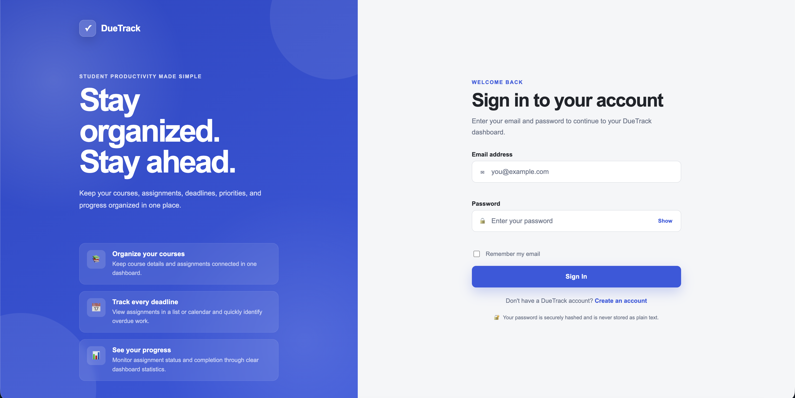
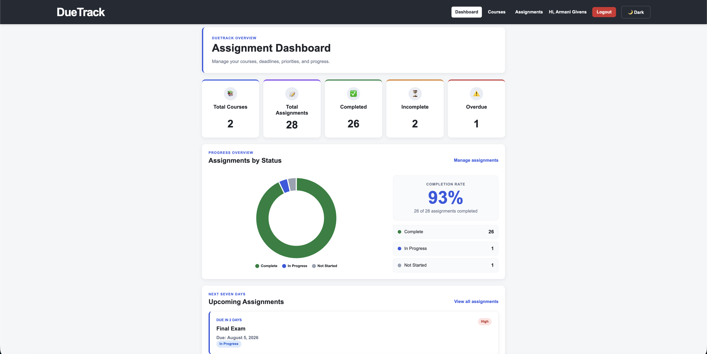
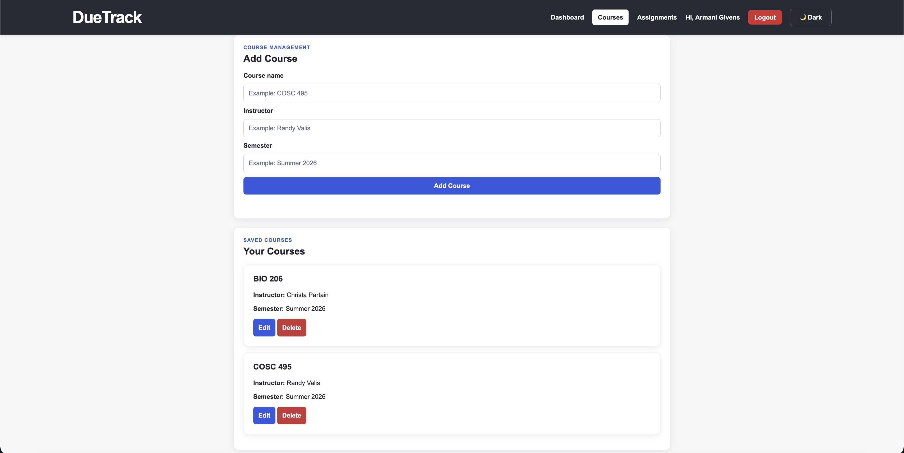
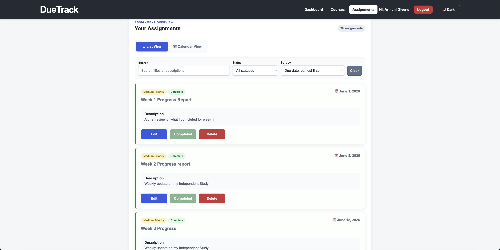
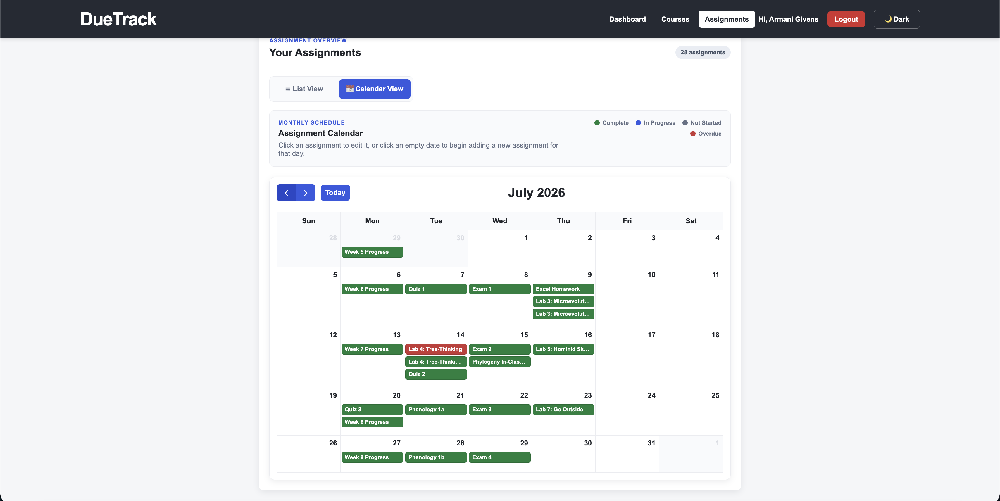
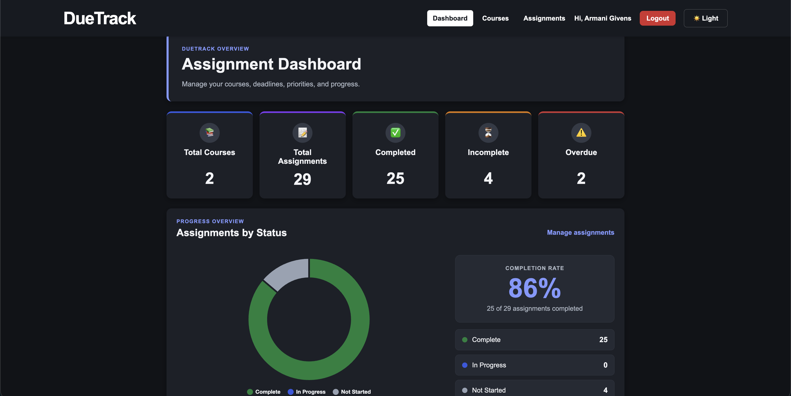

# DueTrack

**DueTrack** is a full-stack web application developed as part of **COSC 495 – Independent Study** at **Towson University**.

The application helps students organize coursework by managing courses, assignments, priorities, due dates, and completion status through a secure web-based interface.

Over the course of this independent study, the project evolved from an initial concept into a complete assignment management system featuring authentication, database integration, RESTful APIs, automated testing, dashboard analytics, and an interactive calendar interface.

---

## Highlights

- 🔐 Secure user authentication with bcrypt and Express sessions
- 📚 Course and assignment management
- 📅 Interactive assignment calendar
- 📊 Dashboard analytics with charts
- 🔎 Assignment search, filtering, and sorting
- 🌙 Light and dark mode
- 🧪 Automated API testing using Jest and Supertest
- 💾 SQLite database with RESTful REST API

---

# Features

## User Authentication
- Secure user registration
- Secure user login
- Password hashing using bcrypt
- Session-based authentication
- Logout functionality
- Protected application pages
- User-specific data access

## Dashboard
- Assignment statistics
- Course statistics
- Completed assignment count
- Incomplete assignment count
- Overdue assignment count
- Upcoming assignment list
- Assignment status chart
- Dark mode support

## Course Management
- Create courses
- Edit courses
- Delete courses
- Store instructor information
- Store semester information

## Assignment Management
- Create assignments
- Edit assignments
- Delete assignments
- Mark assignments complete
- Assignment priorities
- Assignment status tracking
- Due date tracking
- Search assignments
- Filter assignments
- Sort assignments

## Calendar
- Monthly assignment calendar
- Event selection
- Calendar/List view switching

## User Experience
- Responsive interface
- Dark mode
- Confirmation dialogs
- Success and error messages
- Automatic page updates
- Session expiration handling

---

# Technology Stack

## Frontend
- HTML5
- CSS3
- JavaScript (ES6)

## Backend
- Node.js
- Express.js

## Database
- SQLite

## Authentication
- bcrypt
- express-session

## Testing
- Jest
- Supertest

## Version Control
- Git
- GitHub

  ---

# Installation

## Prerequisites

Before running DueTrack, install the following software:

- Node.js (v24 LTS or newer)
- npm
- Git

---

## Clone the Repository

```bash
git clone https://github.com/agivens5/DueTrack.git
```

Move into the project folder:

```bash
cd DueTrack
```

---

## Install Dependencies

Navigate to the server directory:

```bash
cd server
```

Install the required packages:

```bash
npm install
```

---

## Start the Application

Start the Express server:

```bash
node server.js
```

The application will be available at:

```
http://localhost:3000
```

---

## Running Automated Tests

DueTrack includes automated API testing using Jest and Supertest.

Run the test suite:

```bash
npm test
```

---

# Authentication

DueTrack uses secure session-based authentication to protect user accounts and application data.

### Authentication Features

- User registration
- User login
- User logout
- Password hashing using bcrypt
- Express session management
- Protected API endpoints
- Protected frontend pages
- User-specific database records
- Automatic session expiration handling

Only authenticated users can access the Dashboard, Courses, and Assignments pages.

---

# REST API

## Authentication

| Method | Endpoint | Description |
|---------|----------|-------------|
| POST | `/api/auth/register` | Register a new user |
| POST | `/api/auth/login` | Log in |
| POST | `/api/auth/logout` | Log out |
| GET | `/api/auth/me` | Get current user |

---

## Courses

| Method | Endpoint | Description |
|---------|----------|-------------|
| GET | `/api/courses` | Retrieve all courses |
| GET | `/api/courses/:id` | Retrieve a single course |
| POST | `/api/courses` | Create a course |
| PUT | `/api/courses/:id` | Update a course |
| DELETE | `/api/courses/:id` | Delete a course |

---

## Assignments

| Method | Endpoint | Description |
|---------|----------|-------------|
| GET | `/api/assignments` | Retrieve all assignments |
| GET | `/api/assignments/:id` | Retrieve a single assignment |
| POST | `/api/assignments` | Create an assignment |
| PUT | `/api/assignments/:id` | Update an assignment |
| DELETE | `/api/assignments/:id` | Delete an assignment |

---

# Project Structure

```text
DueTrack
│
├── client
│   ├── css
│   │   ├── auth.css
│   │   └── styles.css
│   │
│   ├── js
│   │   ├── assignments.js
│   │   ├── auth.js
│   │   ├── courses.js
│   │   ├── dashboard.js
│   │   ├── login.js
│   │   ├── register.js
│   │   └── theme.js
│   │
│   ├── assignments.html
│   ├── courses.html
│   ├── index.html
│   ├── login.html
│   └── register.html
│
├── database
│   ├── duetrack.db
│   └── duetrack.test.db
│
├── docs
│   └── screenshots
└── server
    ├── controllers
    ├── middleware
    │   └── requireAuth.js
    ├── models
    ├── routes
    │   ├── assignmentRoutes.js
    │   ├── authRoutes.js
    │   └── courseRoutes.js
    ├── tests
    ├── package.json
    └── server.js
```
---

# Screenshots

The following screenshots demonstrate the primary features of DueTrack.

## Login Page



---

## Registration Page


---

## Dashboard

Displays assignment statistics, upcoming assignments, and an assignment status chart.



---

## Courses

Manage courses by creating, editing, and deleting course information.



---

## Assignments

Create, update, delete, search, filter, and sort assignments.



---

## Calendar View

View assignments on an interactive monthly calendar.



---

## Dark Mode

Switch between light and dark themes.



---

# Testing

DueTrack was tested throughout development using both automated and manual testing.

## Automated Testing

The backend API was tested using:

- Jest
- Supertest

Automated tests verify:

- Course CRUD operations
- Assignment CRUD operations
- Request validation
- Error handling
- HTTP status codes

Run the automated tests:

```bash
npm test
```

---

## Manual Testing

The following functionality was verified manually:

- User registration
- User login
- User logout
- Protected routes
- Course CRUD operations
- Assignment CRUD operations
- Search functionality
- Filtering
- Sorting
- Calendar view
- Dashboard statistics
- Dark mode
- Responsive layout

---

# Development Timeline

| Week | Milestone |
|-------|-----------|
| 1 | Research and project planning |
| 2 | Database and software architecture design |
| 3 | Backend setup using Express and SQLite |
| 4 | Database integration and API development |
| 5 | Complete CRUD API implementation |
| 6 | Automated API testing using Jest and Supertest |
| 7 | Frontend development and backend integration |
| 8 | User interface improvements and additional features |
| 9 | Authentication, user management, and application security |
| 10 | Documentation, testing, and final project polish |

---

# Challenges & Lessons Learned

This independent study provided practical experience designing, developing, testing, and documenting a complete full-stack web application.

Throughout the project I strengthened my understanding of:

- RESTful API development
- Express.js application architecture
- SQLite database design
- Session-based authentication
- Password hashing using bcrypt
- Frontend and backend integration
- Automated API testing with Jest and Supertest
- Git and GitHub version control
- Debugging complex application issues
- Software documentation and project organization

Developing DueTrack also reinforced the importance of incremental development, testing throughout the software lifecycle, and maintaining clear project documentation.

Completing this project strengthened my confidence in designing, developing, testing, debugging, and documenting a full-stack web application from initial planning through final implementation.

---

# Future Improvements

Possible future enhancements include:

- Email assignment reminders
- Password reset functionality
- User profile management
- Course color customization
- Assignment attachments
- Assignment categories and tags
- Export assignments to CSV or PDF
- Mobile application
- Cloud database deployment

---

# Author

**Armani Givens**

B.S. Computer Science

Towson University

COSC 495 – Independent Study

GitHub: https://github.com/agivens5/DueTrack

---

## Acknowledgements

This project was developed as the final project for **COSC 495 – Independent Study** at **Towson University** under the supervision of the course instructor.
